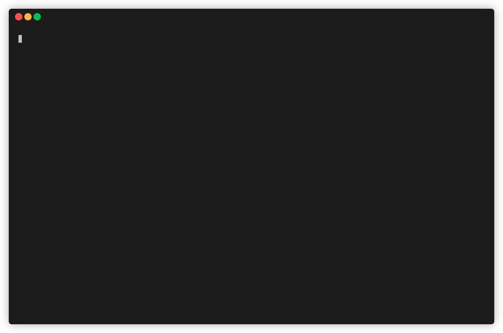
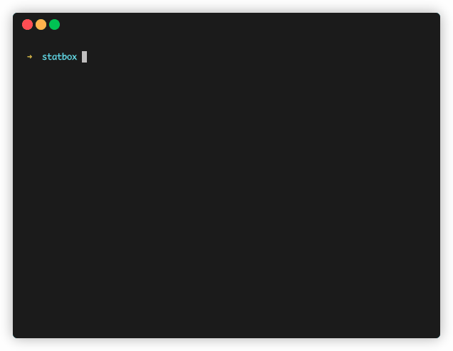

# Statbox
**You watch, aghast, as a torrential downpour of garbage floods your inbox. The last bastions of hope, your email provider's spam filters, have long since been washed away by the deluge of advertising, marketing, and poorly-disguised spam. You regret using your primary email address to make an account on that shady website, and as the number of unread emails crosses 4000, you feel dizzy.** *Statbox can help!*

Statbox counts emails by various metrics and displays the final results, so you can quickly identify the worst spammers, delete their messages, and reclaim your pristine inbox.

In its current form, Statbox is capable of counting emails by the following metrics:
* **Address**: The full email address. In the email address "the.spammers@sketchy.website.com", this field would be the entire thing.
* **Domain**: The last two segments of the email address. In the above example, the domain would be "website.com". Other domains include "varunramani.com", "github.com", and "google.com".
* **Top Level Domain (TLD)**: The last segment of the email address. In the above example, this would be "com". Other TLDs include "org" and "net".
* **HOSTNAME**: Everything following the '@' symbol. In the above example, this would be "sketchy.website.com". Other hostnames include "gmail.com", "mail.google.com", and "yahoo.com".

## Getting Started
### Dependencies
You will need the following in order to use Statbox:
* Python (>3.6)
### Installation
If you have Git installed, you can clone Statbox into any folder of your choice. If not, 
you can download Statbox as a zip archive from GitHub.
### Configuration
Inside Statbox's folder, create a file named `creds.json` with the following contents:
```json
{
    "username": "youremailaddress@gmail.com",
    "password": "youremailpassword"
}
```

### Running Statbox
`python3 statbox.py`


*Note*:
When Statbox is executed for the first time, a file named `messagedump` will appear in the same directory as the main
Python script. This file caches downloaded messages so that Statbox does not have to re-download them each time it is 
run. Consequently, Statbox will refuse to refresh if this file is present. To obtain the latest information about 
your inbox, delete this file and let Statbox re-create it.

## The Data
Data about your inbox can be found under the `counts/` directory once you have run Statbox.
